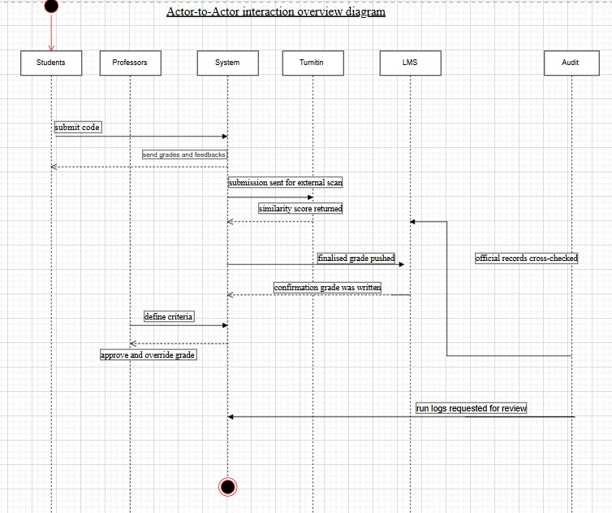
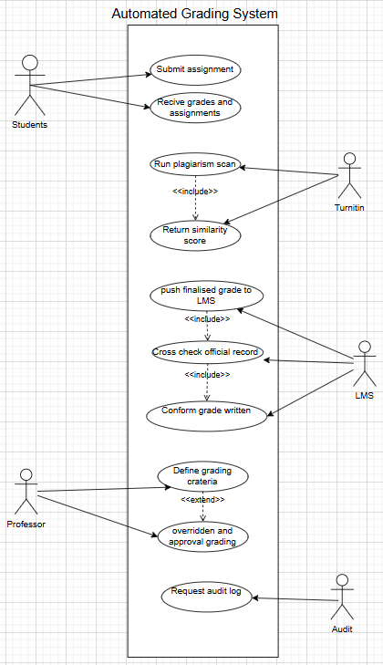
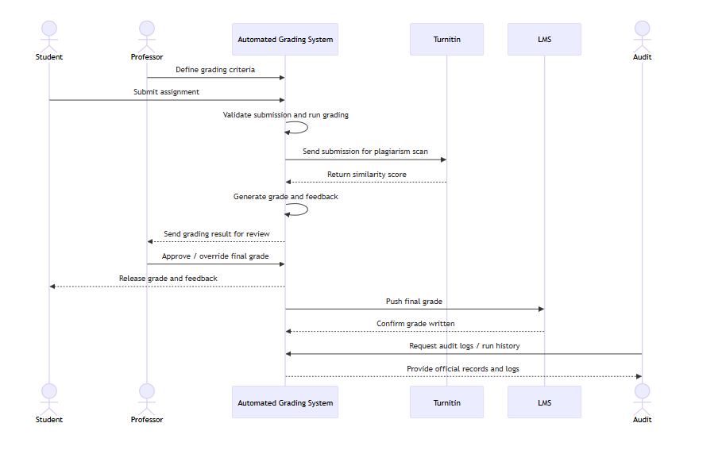

# Practical Report - Automated Grading System Design

### 1. Introduction
In the current scenario of Software Engineering (SWE) courses in universities, the number of programming assignments from the students is very large. At present, the grading process is manual, where the professors clone the student repository and run the program locally using the student code and grade it using tools such as VS Code.

The system is required to automate the grading process, reduce the workload of the professors, and provide faster and more efficient grading results to the students. The grading process is usually automated, where the student code is executed and the results are obtained within a fraction of a second. Moreover, it is more efficient in providing fair grading results, as the student code is evaluated according to the grading criteria.

At present, there is no plagiarism detection system, and the chances of cheating are very high. Moreover, there is no system in place to keep track of the grades and the results of the student code execution. Hence, it is very essential to have an automated grading and plagiarism detection system in place within the University LMS.

## 2. Requirements Analysis
#### Functional Requirements
###### Student
- Student will be able to submit the assignment and upload the code
- The student will be allowed to submit as many times as they want before the deadline
- The student will be able to see their score and feedback after each submission

###### Professor
- The professor will be able to set the grading criteria before the start of the assignment
- The professor will be able to set the deadline and time of the assignment
- The professor will be able to see the plagiarism flags
- The professor will be able to see all the submissions of the assignment
- The professor will be able to see the plagiarism report of each submission
- The professor will be able to override the plagiarism flags
- The professor will be able to see the grading criteria of the assignment

##### system 
- the system must reject any submission received after the deadline set by the professor, with no exceptions.
- the system must provide a plagiarism report for each submission.
- the system must provide a grading report for each submission.
- the system must provide a feedback report for each submission.
- the system must be able to handle multiple assignments at the same time.
- the system must be able to handle multiple students at the same time.
- the system must be able to handle multiple professors at the same time.
- the system must be able to handle multiple submissions for the same assignment.

#### Non-Functional Requirements
- Performance: must be able to handle 300+ students.
- Reliability: grading must be consistent and accurate.
- Security: must be able to protect students.
- Auditability: all grades must be recorded.
- Scalability: must be able to handle more and more students.

## 3. Architectural Design
### 3.1 Interaction Overview Diagram (IoD)

 - linkhttps://app.diagrams.net/?src=about
- This diagram shows how all actors—Student, Professor, System, Turnitin, LMS, and Audit Body—collaborate to complete the grading process. The automated grading System acts as the central component that connects all actors, enabling efficient grading, plagiarism detection, secure storage, and auditability.

## 3.2 Use Case Diagram (UCD)

 - Link https://app.diagrams.net/?src=about#
- The Use Case Diagram represents how the Automated Grading System supports interactions between students, professors, external services like Turnitin, the LMS, and the audit body. It ensures that assignments can be submitted, graded automatically, checked for plagiarism, reviewed by professors, and stored securely for future auditing

## 3.3 System Flow (IoD based on Use Case)

- https://mermaid.live/view#pako:eNqFVE1v2zAM_SuCzmmWxLXj-hAgaIFeVqBYhh0GX1SbdoRZkkdJ6bIg_32UPwI3QbEcgpjkI997ZHzihSmBZ9zCbw-6gCcpahQq14w-onAG2c75ErSbhl7RVGCtwT7YCnSykK3Qju2O1oFiwrKtd0YJByV7RlFKXQ-5W8x3j1o6qW8zX19207lbX0oi0ocuJO42m75zxp6gkhpYPQwsUDpAKXrAIGRSvvNvSjoia2Wt1UVkn57U_RCNLEkKswFA1UYzoUuGXo-zrpCjJJoBVDjBVaSjbUQtBUqrmC3EoGeE3E0GfwNHUWalkg3VuyPVG4RPaD6DBgw0AyfoGFYA5Zsofn1AEORi3kBwdAzB-sZ1JBEOEt4_93rbtmgOwL4w-kaUNJHMF00__XrgYH6Q1ICw_-W42dDuM_bq7f62LaWmLj0aXUlUQ8t38snBYGp3MR8MpTu3tPIQZ42pLfEPa9xLSxd2vKbd4bOg_xAEmqqi0yQyCLSH0nb8Qxc-4zVZwDOHHmZcASoRHvkpdMy524OCnGf0s4RKkMc5z_WZYHTnP41RIxKNr_c8q0Rj6cm34eyGP-WlhBYG-Gi8djyLll0Lnp34H54t03ieruNlvE7j1TJOKXmkaJTMoyhKkihdPKzW93F6nvG_3dDFPF6kD4tkFadxkiRxdD_jQJINvvQvhu79cP4HmeJoZw
 
 - The Interaction Overview Diagram (IoD), as derived from the use case, presents the entire workflow of the Automated Grading System, in which all the actors interact through the system to produce the final output. The entire workflow begins when the professor establishes the grading criteria, followed by the student’s submission of the assignment to the system. The system then validates the submission, grades the assignment, and sends the code to Turnitin for plagiarism checking, which produces a similarity score. Based on the score, the system produces grades and sends them to the professor for review. The professor approves the final grade, and the system sends the results to the student and produces the grade in the LMS. Finally, the audit body requests run logs and official records from the system.

 # 4. Quality Attributes Consideration
 - Performance
The system should quickly process and grade assignments for many students.

- Security
Protects student data, submissions, and grades from unauthorized access.

- Reliability
Ensures accurate and consistent grading results every time.

- Scalability
Can handle increasing number of students and submissions without slowing down.

- Maintainability
Easy to update grading rules, fix issues, and improve the system.

### 5. Reflection
- I learned the importance of analyzing the system’s requirements by - identifying the functional and non-functional needs.
- I understood the importance of designing the system with the help of UML diagrams such as IoD and Use Case Diagrams.
- I learned the importance of the interaction of various actors such as student, professor, LMS, and plagiarism tools.

### Challenges faced
#### Defining Clear Requirements
It was difficult to identify all the functional and non-functional requirements clearly. This was solved by separating the requirements by role — Student, Professor, and System — which made it easier to organize and avoid overlap.

#### Designing the System Architecture
Representing the interaction between multiple actors like Student, Professor, Turnitin, LMS, and Audit Body in one diagram was complex. This was solved by using two separate diagrams — the IoD for overall workflow and the Use Case Diagram for individual actor interactions.

# conclusion
The Automated Grading System was created with the intention of reducing the workload of professors while delivering fast, accurate, and fair grading results to students. From the analysis of the functional and non-functional requirements, the system was able to address the major issues in grading, plagiarism, and tracking grades.
The utilization of UML diagrams, specifically Interaction Overview Diagrams and Use Case Diagrams, enabled the clear depiction of the workflow and interaction of all actors. The integration of external services also made the system more reliable.
This system will definitely improve the grading system in the University LMS by making it more automated, consistent, and traceable, with fairness and security in grading results.
