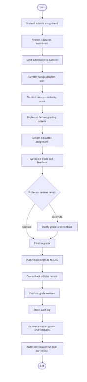
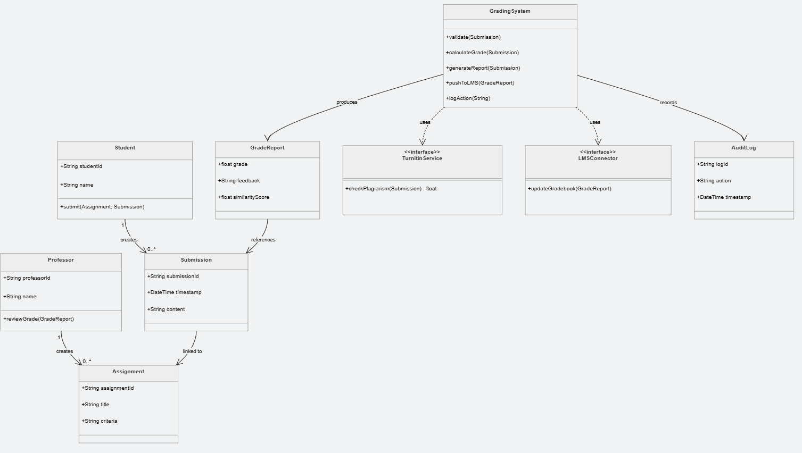

# Practical 3 Class Diagram and Activity Diagram

## Activity Diagram

This diagram illustrates the workflow and sequence of activities in the system, showing how different processes flow from start to completion.

## Class Diagram

This diagram shows the static structure of the system, including classes, their attributes, methods, and the relationships between them.
